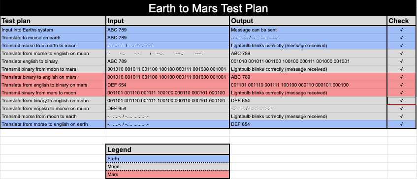
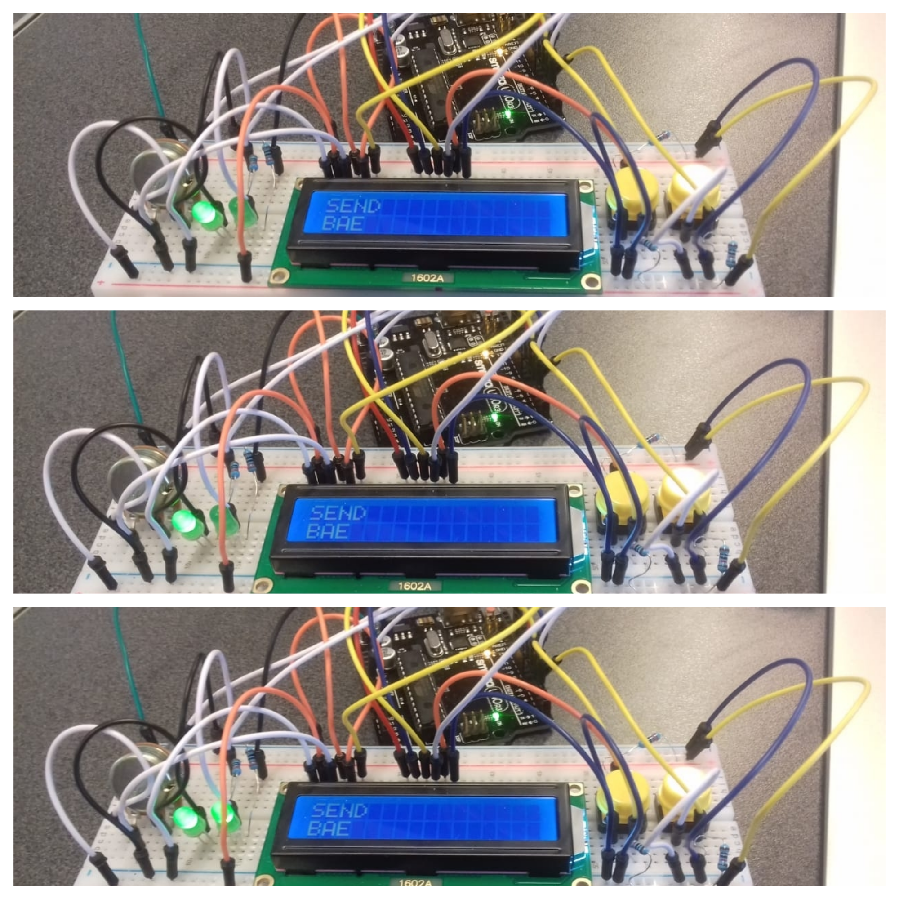

# •••Communication••• 
# Morse code and Binary code UNIT2 Project
-------------------------------------------------------------
# KelvenManuel 


Communication between the Earth the moon and Mars using Arduino 

# Contents
---------
  1. [Planning](#Planning)
  2. [Design](#Design)
  3. [Development](#Development)
  4. [Evaluation](#Evaluation)
  
  
 # 1.Planning 
 -------------
 
 ### Definition of the Problem 
 In 2050, The company "Explore", a big company of communications, wants to explore other planets and develop communication between them.therefore create spatial communication and develop their communication skills to another level. On the other hand, the communication nowadays still uncertain. they built 3 station, one in the Earth that can only communicate using Morse code, the second station in the Moon that can only communicate in Binary and the final station in Mars that they need us to provide a channel of communication. 
 
 ### Proposed Solution 
 Create a program using Arduino that will allow the user to communicate between the station, in other words,  efficient coding that will allow the user to use Binary, Morse and English as a way of communication between stations, being able to recieve and send messages.
 
Why Arduino?
we decide to use Arduino because is a great tool for developing interactive objects, taking inputs from a variety of switches or sensors and controlling a variety of lights. Arduino offer the ability of using lights as a way of communication, were with efficient coding we can create aprogram that can (using lights) send information in english but in Morse and binary communication.
 
 ### success criteria
 
 • Clear understanding about Arduino, Binary codes, and morse codes
 • Communication between the 2 station Earth and Mars using Morse code; 
 • Communication between Mars and the Moon uses Binary code;
 • Data Encoding;
 • find a communication system that allow stations to communicate completely using English but in morse or binary communication
 • Keyboard input on each station is limited to 2push buttons. 
 • 100W lights are buzzers are available 
 
 
 
 # 2.Desing
 ----------
 
# First sketch of system
This the sytem diagram of the program where we put the inputs ( buttons ), the program, and the output (LCD);
In the LCD we are expected to see, and write the message using the pushbuttons. See in fig1

### fig.1

# Traffic lights system using Arduino 

### fig.2

"Introduction of Arduino"
As we see in fig2  we build a basic arduino system, with the board connected with the Arduino Uno using cables, the lights in the board and connected with the board as well. Having the system build and a correct coding we can use the lights this will allow us to turn them ON or OFF according the way that we want. We use Arduino to make a system of traffic lights this that help us to understand how Arduino works. Additionally understand basic coding of the lights, how to turn OFF and ON, this will be essention to achieve our goals in the way that the lights will be our way of communication between stations. this is a prove off our ability to build system and use the lights. Moreover we have the code that we use to make the traffic lights system.( See under this paragraph )

```.sh
void setup()
{
  pinMode(13, OUTPUT);
  pinMode(12, OUTPUT);
  pinMode(11, OUTPUT);
}

void loop()
{
  digitalWrite(13, HIGH);
  delay(1000); // Wait for 1000 millisecond(s)
  digitalWrite(13, LOW);
  delay(1000); // Wait for 1000 millisecond(s)
  digitalWrite(12, HIGH);
  delay(1000); // Wait for 500 millisecond(s)
  digitalWrite(12, LOW);
  delay(1000); // Wait for 500 millisecond(s)
  digitalWrite(11, HIGH);
  delay(1000); // Wait for 1000 millisecond(s)
  digitalWrite(11, LOW);
  delay(1000); // Wait for 1000 millisecond(s)
}
```
# Arduino 
Arduino is an open-source electronics platform based on easy-to-use hardware and software. It's intended for anyone making interactive projects.

# cabes system using Arduino to make a binary count


Hving the basic knowledge about how to build a system with cables and lights using the Arduino, and knowing how to turn ON and OFF we make a system using 6 lights that allow us to see a binary count, using only the lights. Where if the light is ON is 1 and if it is OFF is equal. we can see this count in the fig.4, following by the code that we use to make the binary count.  
### fig.3

```.sh
 int ledPin[] = {13,12,11,10,9,8};
// an arry to define the pins

void setup()
{
  for (int i = 0; i < 5; i++)
  {
    pinMode(ledPin[i], OUTPUT);
  }
}

void loop()
{
  for (byte counter = 0; counter <= 32; counter++)
  {
    displayBinary(counter);
    delay(2000);
  }
}

void displayBinary(byte num)
{
  for (int i = 0; i < 5; i++)
  {
    if (bitRead(num, i)==1)
    {
      digitalWrite(ledPin[i], HIGH);
    }
    else
    {
      digitalWrite(ledPin[i], LOW);
    }
  }

}
```

# FLOW CHARTS 
in this section there are all flowchart of all the programs
English input
English to Morse (vice versa)
English to Binary (vice versa)


In this flowcharts we can see diagrams that depicts the process to create the programs, with this the user can visualize an idea or process we went through, in this flow chart there is a summary off all the codes that we use to create all the programs. These graphics should explain the manner clearly and even give the essence of a process flow in a single look.

### English input 

### English to Morse

### Morse to English

### Binary to English

### English to Binary 


### TEST PLAN

----------------------------------------------------------------------------------------------


 
 # 3.Development 
 --------------
 
 # Using Arduino,coding and lights to build a segment display 
 We still improving our abilities of Arduino coding and Arduino building system, this time we make a segment display that allow us to represent Numbers using lights so if we wnat a number a certain number of lights should be on and the rest of.(See in the fig4 following by the code)
 

### fig.4


```.sh 
int butA = 13;
int butB = 12;
int butC = 11;
int out1 = 10;
int out2 = 9;
int out3 = 8;
int out4 = 7;
int out5 = 6;
int out6 = 5;
int out7 = 4;
  
void setup()
{
  pinMode(butA, INPUT);
  pinMode(butB, INPUT);
  pinMode(butC, INPUT);
  pinMode(out1, OUTPUT);
  pinMode(out2, OUTPUT);
  pinMode(out3, OUTPUT);
  pinMode(out4, OUTPUT);
  pinMode(out5, OUTPUT);
  pinMode(out6, OUTPUT);
  pinMode(out7, OUTPUT);
 
}

void loop()
{
  bool A = digitalRead(butA);
  bool B = digitalRead(butB);
  bool C = digitalRead(butC);
  
  bool eq1 = B || (!A && !C) || (A && C);
  digitalWrite(out1, eq1);
  
  bool eq2 = !A || (C && B) || (!B && !C);
  digitalWrite(out2, eq2);
  
  bool eq3 = (!A && !B) || C || (A && !C);
  digitalWrite(out3, eq3);
  
  bool eq4 = (!A && !C) || (!A && B) || (B && !C) || (A && !B && C);
  digitalWrite(out4, eq4);
  
  bool eq5 = (!A && !C) || (!A && !B);
  digitalWrite(out5, eq5);
  
  bool eq6 = (A && !B) || !C;
  digitalWrite(out6, eq6);
  
  bool eq7 = (A && !C);
  digitalWrite(out7, eq7);
  
}
```
 
 # First steps about Binary code ( binary to decimal conversion ) 
 ```.sh 
 count base 8 binary    count base 4 binary       desimal 15 to Binary 
 
  n%8                    n%4                      num   A    B    C    D 
  
   0                      0                        0    0    0    0    0
   1                      1                        1    0    0    0    1
   2                      2                        2    0    0    1    0
   3                      3                        3    0    0    1    1 
   4                      0                        4    0    1    0    0
   5                      1                        5    0    1    0    1 
   6                      2                        6    0    1    1    0
   7                      3                        7    0    1    1    1
   0                      0                        8    1    0    0    0 
   1                      1                        9    1    0    0    1
   2                      2                        10   1    0    1    0 
   3                      3                        11   1    0    1    1 
   4                      0                        12   1    1    0    0
   5                      1                        13   1    1    0    1
   6                      2                        14   1    1    1    0 
   7                      3                        15   1    1    1    1 
   
                                                       bit  bit  bit  bit 
                                                        3    2    1    0 
```
# conversion of base 2 to 10
1. Write down the binary number.
2. Write down the position of the individual numbers (1’s and 0’s) starting from the furthermost right. The first digit should have a position zero.
3. Express the positions in terms of powers of two. (eg. 8^0 for position zero)
4. Multiply the individual numbers by the powers of two
5. Add the products.
# conversion of base 10 to other bases 
1. Write down the number.
2. Write down the position of the individual numbers starting from the furthermost right. The first digit should have a position zero.
3. Express the positions in terms of powers of the base. (eg. 8^0 for position zero)
4. Multiply the individual numbers by the powers of the base.
5. Add the products.

# The HEXADECIMAL base 
this base is different from other, the numbers 10 to 15 are expressed using only digits, instead of using digits. 
Eg: A=10 B=11 C=12 D=13 E=14 F=15 


# Boolean Operators, Logit gates and truth tables 

### fig.5
 
As we can see in the fig5 the essensial Boolean operations ( logic gates ) and their match in basic arithmetic operations. [right side ]
Addictionaly we can see the truth tables for the basic Boolean operation( OR AND NOT XOR ) [left side ]


### Understanding Boolean operations 
It is important to understand it because Boolean Operators are simple words (AND, OR, NOT or AND NOT) used as
conjunctions to combine or exclude keywords in a search, resulting in more focused and
productive results.

# Data Encoding
A: Encoding is the process of converting the data or a given sequence of characters, symbols, alphabets etc., into a specified format, for the secured transmission of data. In other words, Encoding is the process of using various patterns of voltage or current levels to represent 1s and 0s of the digital signals on the transmission link.[4] This is important because we are using it to change our comunication English to Morse to Binary, where in the binary we use light to represent 1 and 0 in binary and in Morse we use dot and dash to communicate. Even with this we still communicate.


# What is Usability?
A: Usability is the ease of use learnability of a human-made object.[1]

### Principles of desgn 
• Discoverability
• Feedback 

# Morse code

According with the problem there is one station that can only communicate in Morse. Definition of Morse code
: either of two codes consisting of variously spaced dots and dashes or long and short sounds used for transmitting messages by audible or visual signals.( According with Merriam-Webter[2]) 

Other definition is Morse code is a method used in telecommunication to encode text characters as standardized sequences of two different signal durations, called dots and dashes or dits and dahs. Morse code is named for Samuel F. B. Morse, an inventor of the telegraph.( According with Wikipedia[3])

Understant this communication will be essancial to achieve our main goal in this project. IN the fig6 we can see the international morse code that we are going to use. Therefore, create a program that can send and read messages in morse code. 


### fig.6


# English input System 
--------------------------

this tables show us Every input that we are goin to use to communicate with other station in Binary 


### fig.7

# Arduino && English input system 

Using the Arduino and practical codes, we were able to create a system where we can write a message on the Arduino's LCD using only two buttons. Additionally, having within that system the option to delete, space and send the message "managing only 2 buttons".


### fig.8

### English input system
This is the cide that we use to write a message using Arduino, the message will be show in the Lcd that would be connected with the Arduino. This is the first code that we use to complete the project and have basic English communication  

```.sh 
// include the library code:
#include <LiquidCrystal.h>
int index = 0; 
// add all the letters and digits to the keyboard
String keyboard[]={"A", "B","C", "D", "E", "F", "G", "H", "I", "J", "K", "L", "M", "N", "O", "P", "Q", "R", "S", "T", "U", "V", "W", "X", "Y", "Z", "0", "1", "2", "3", "4", "5", "6", "7", "8", "9"};
String text = "";
int numOptions = 3;

char letters;

string code;
char try[6]={"0", "0","0", "0", "0", "0"};
Strind[] = lenght;


// initialize the library with the numbers of the interface pins
LiquidCrystal lcd(12, 11, 5, 4, 9, 8);

void setup() {
  // set up the LCD's number of columns and rows:
  lcd.begin(16,2);
  // Print a message to the LCD.
  attachInterrupt(0, changeLetter, RISING);//button A in port 2
  attachInterrupt(1, selected, RISING);//button B in port 3
  
 
  
}

void loop() {
  // set the cursor to column 0, line 1
  // (note: line 1 is the second row, since counting begins with 0):
  lcd.clear();
  lcd.setCursor(0, 0);
  lcd.print(keyboard[index]);
  lcd.setCursor(0, 1);
  lcd.print(text);
  delay(100);
}

//This function changes the letter in the keyboard
void changeLetter(){
  static unsigned long last_interrupt_time = 0;
  unsigned long interrupt_time = millis();
  if (interrupt_time - last_interrupt_time > 200)
  {
  
    last_interrupt_time = interrupt_time;// If interrupts come faster than 200ms, assum
    index++;
      //check for the max row number
    if(index==numOptions){
      index=0; //loop back to first row
    } 
 }
}

//this function adds the letter to the text or send the msg
void selected(){
  static unsigned long last_interrupt_time = 0;
  unsigned long interrupt_time = millis();
  if (interrupt_time - last_interrupt_time > 200)
  {
  
    last_interrupt_time = interrupt_time;// If interrupts come faster than 200ms, assum
    
    String key = keyboard[index];
    if (key == "DEL")
    {
      int len = text.length();
      text.remove(len-1);
    }
    else if(key == "SENT")
    {
      convertBin();
      text="";
    }
    else if(key == "SPACE")
    {
	   text += " ";
    }else{
      text += key;
    }
    index = 0; //restart the index
  }
  
}
```
-------------------------------------------------------------------------------------

### English to Morse
This is the code that allow the comunication using the Arduino English to Morse, with this code you can write a message in english then the arduino will read it and translate to morse using the lights. This is one of the essential codes to complete the project and allow the communication.  
```.sh
// This program serves as an input method for the English language, using only 2 buttons. 
// When button A is pressed, the selection in focus is changed, through a rotation in a list. 
// If button B is pressed, the character or action is selected, and catenated to the final word. 
// “SEND” and “DEL” are actions. 
#include <LiquidCrystal.h>

String text = "";
int index = 0; 
// add all the letters and digits to the keyboard
String keyboard[] = {"SEND", "E", "T", "A", "O", "I", "N", "S", "R", "H", "L", "D", "C", "U", "M", "F", "P", "G", "W", "Y", "B", "V", "K", "X", "J", "Q", "Z", "SPACE", "DEL", "0", "1", "2", "3", "4", "5", "6", "7", "8", "9"};

int letter;
int numOptions = 39; 
int Aled = 10;


LiquidCrystal lcd(13, 12, 7, 6, 5, 4);

void setup()
{
  Serial.begin(9600);
  lcd.begin(16, 2);
  attachInterrupt(0, changeLetter, RISING);//button A in port 2
  attachInterrupt(1, selected, RISING);//button B in port 3
  pinMode(Aled, OUTPUT);
  lcd.setCursor(0, 1);
  lcd.print("Starting");
  delay(1000);
  lcd.clear();
  
  
}

void loop()
{
  
  lcd.setCursor(0, 0);
  lcd.print(keyboard[index]);
  
  lcd.setCursor(0, 1);
  lcd.print(text);
  delay(100);
  lcd.clear();
  
}


void changeLetter(){
  index++;
  // The if condition is checking if the user has gone through the whole list
  // If yes, the character selection is reset to the first index (0).
  if (index>numOptions){
  	index=0; 
  } 
}


void selected(){
  String key = keyboard[index];
  // If DEL key is selected, remove last appended char to text
  if (key == "DEL") {
    int len = text.length();
    text.remove(len-1);
  }
  // If SEND is selected, reset the text variable to ""
  else if (key == "SEND") {
    Serial.println("Message sent");
    lcd.clear();
    lcd.print("Message sent");
    
    
    for (int i=0; i<text.length(); i++){
      letter = text[i];
      Serial.print(letter);
      switch (letter) {
    	case 'A':
        	dot();
      		dash( );
        	delay(300000);
            break;
    	case 'B':
     		dash();
        	dot();
        	dot();
        	dot();
        	delay(300000);
            break;
    	case 'C':
      		dash();
         	dot();
      		dash();
         	dot();
        	delay(300000);
            break;
    	case 'D':
       		dash();
          	dot();
          	dot();
        	delay(300000);
            break;
    	case 'E':
         	dot();
        	delay(300000);
            break;
    	case 'F':
        	dot();
        	dot();
     		dash();
        	dot();
        	delay(300000);
            break;
    	case 'G':
     		dash();
     		dash();
       		dot();
        	delay(300000);
            break;
    	case 'H':
       		dot();
       		dot();
       		dot();
       		dot();
        	delay(300000);
            break;
    	case 'I':
       		dot();
       		dot();
        	delay(300000);
            break;
    	case 'J':
        	dot();
     		dash();
     		dash();
     		dash();
        	delay(300000);
            break;
    	case 'K':
     		dash();
        	dot();
     		dash();
        	delay(300000);
            break;
    	case 'L':
        	dot();
     		dash();
       		dot();
       		dot();
        	delay(300000);
            break;
    	case 'M':
     		dash();
     		dash();
        	delay(300000);
            break;
    	case 'N':
     		dash();
        	dot();
        	delay(300000);
            break;
    	case 'O':
     		dash();
     		dash();
     		dash();
        	delay(300000);
            break;
    	case 'P':
       		dot();
     		dash();
     		dash();
       		dot();
        	delay(300000);
            break;
    	case 'Q':
     		dash();
     		dash();
        	dot();
     		dash();
        	delay(300000);
            break;
    	case 'R':
        	dot();
     		dash();
      		dot();
        	delay(300000);
            break;
    	case 'S':
      		dot();
      		dot();
      		dot();
        	delay(300000);
            break;
    	case 'T':
     		dash();
        	delay(300000);
            break;
    	case 'U':
      		dot();
      		dot();
     		dash();
        	delay(300000);
            break;
    	case 'V':
      		dot();
      		dot();
      		dot();
     		dash();
        	delay(300000);
            break;
    	case 'W':
      		dot();
     		dash();
     		dash();
        	delay(300000);
            break;
    	case 'X':
     		dash();
      		dot();
      		dot();
     		dash();
        	delay(300000);
            break;
    	case 'Y':
     		dash();
      		dot();
     		dash();
     		dash();
        	delay(300000);
            break;
    	case 'Z':
     		dash();
     		dash();
      		dot();
      		dot();
        	delay(300000);
            break;
    	case '0':
     		dash();
     		dash();
     		dash();
     		dash();
     		dash();
        	delay(300000);
            break;
    	case '1':
      		dot();
     		dash();
     		dash();
     		dash();
     		dash();
        	delay(300000);
            break;
    	case '2':
      		dot();
      		dot();
     		dash();
     		dash();
     		dash();
        	delay(300000);
            break;
    	case '3':
      		dot();
      		dot();
      		dot();
     		dash();
     		dash();
        	delay(300000);
            break;
    	case '4':
      		dot();
      		dot();
      		dot();
      		dot();
     		dash();
        	delay(300000);
            break;
    	case '5':
      		dot();
      		dot();
      		dot();
      		dot();
      		dot();
        	delay(300000);
            break;
    	case '6':
     		dash();
      		dot();
      		dot();
      		dot();
      		dot();
        	delay(300000);
            break;
    	case '7':
     		dash();
     		dash();
      		dot();
      		dot();
      		dot();
        	delay(300000);
            break;
    	case '8':
     		dash();
     		dash();
     		dash();
      		dot();
      		dot();
        	delay(300000);
            break;
    	case '9':
        	dash();
         	dash();
         	dash();
         	dash();
         	dot();
        	delay(300000);
            break;
      }
    }
    text  = "";
  }else if (key == "SPACE") {
   text+= " ";
  }
  else {
    text += key; // Append char to message
  }
  // Always reset index of array after selection
  index = 0;
}
    
void dot(){
  //in this function blink the light for one second
  Serial.print("I am at dot function");
  digitalWrite(Aled, HIGH);
  delay(100000);
  digitalWrite(Aled, LOW);
  delay(100000);
}
    
void dash(){
  //in this function blink the light for three second
    Serial.print("I am at dash function");

  digitalWrite(Aled, HIGH);
  delay(300000);
  digitalWrite(Aled, LOW);
  delay(100000);  
}

```
---------------------------------------------------------------------
### Morse to English 
this is the code that we use to translate morse code in English communication this will allow one of the station (Moon) to receive morse communication and translate the same in english without too much effort, The moon will recieve communication in Morse and the program will tranlate it in English.

```.sh
// include the library code:
#include <LiquidCrystal.h>

// initialize the library with the numbers of the interface pins
LiquidCrystal lcd(12, 11, 5, 4, 7, 6);
String text = " ";
int butA = 3;
int butB = 2;
int counter = 0;
String letter = " ";

void setup() {
  // set up the LCD's number of columns and rows:
  lcd.begin(16, 2);
  // Print a message to the LCD.
  lcd.print("Enter morse msg");
  pinMode(butA, INPUT);
  pinMode(butB, INPUT);
  attachInterrupt(1, dot, RISING);
  attachInterrupt(0, dash, RISING);
}

void loop() {
  delay(100);
  counter++;
  if(counter == 20){
    translate();
  }
  else if(counter == 50){
    send();
  }
}
 
void dot()
{
  lcd.clear();
  letter += ".";
  lcd.print(letter);
  counter = 0;
}

void dash()
{
  lcd.clear();
  letter += "-";
  lcd.print(letter);
  counter = 0;
}
  
// IRVIN DO THIS PART
void translate()
{
  //A
  if (letter == " .-"){
    text += "a";
  }
  
  //B
  if (letter == " -..."){
    text += "b";
  }
  
  //C
  if (letter == " -.-."){
    text += "c";
  }
  
  //D
  if (letter == " -.."){
    text += "d";
  }
  
  //E
  if (letter == " ."){
    text += "e";
  }
  
  //F
  if (letter == " ..-."){
    text += "f";
  }
  
  //G
  if (letter == " --."){
    text += "g";
  }
  
  //H
  if (letter == " ...."){
    text += "h";
  }
  
  //I
  if (letter == " .."){
    text += "i";
  }
  
  //J
  if (letter == " .---"){
    text += "j";
  }
  
  //K
  if (letter == " -.-"){
    text += "k";
  }
  
  //L
  if (letter == " .-.."){
    text += "l";
  }
  
  //M
  if (letter == " --"){
    text += "m";
  }
  
  //N
  if (letter == " -."){
    text += "n";
  }
  
  //O
  if (letter == " ---"){
    text += "o";
  }
  
  //P
  if (letter == " .--."){
    text += "p";
  }
  
  //Q
  if (letter == " --.-"){
    text += "q";
  }
  
  //R
  if (letter == " .-."){
    text += "r";
  }
  
  //S
  if (letter == " ..."){
    text += "s";
  }
  
  //T
  if (letter == " -"){
    text += "t";
  }
  
  //U
  if (letter == " ..-"){
    text += "u";
  }
  
  //V
  if (letter == " ...-"){
    text += "v";
  }
  
  //W
  if (letter == " .--"){
    text += "w";
  }
  
  //X
  if (letter == " -..-"){
    text += "x";
  }
  
  //y
  if (letter == " -.--"){
    text += "y";
  }
  
  //Z
  if (letter == " --.."){
    text += "z";
  }
  
  //1
  if (letter == " .----"){
    text += "1";
  }
  
  //2
  if (letter == " ..---"){
    text += "2";
  }
  
  //3
  if (letter == " ...--"){
    text += "3";
  }
  
  //4
  if (letter == " ....-"){
    text += "4";
  }
  
  //5
  if (letter == " ....."){
    text += "5";
  }
  
  //6
  if (letter == " -...."){
    text += "6";
  }
  
  //7
  if (letter == " --..."){
    text += "7";
  }
  
  //8
  if (letter == " ---.."){
    text += "8";
  }
  
  //9
  if (letter == " ----."){
    text += "9";
  }
  
  //0
  if (letter == " -----"){
    text += "";
  }
  
  //.
  if (letter == " .-.-.-"){
    text += ".";
  }
  
  //,
  if (letter == " --..--"){
    text += ",";
  }
  
  //?
  if (letter == " ..--.."){
    text += "?";
  }
  lcd.setCursor(0,1);
  lcd.print(text);
  letter = " ";
}

void send()
{
  lcd.clear();
  lcd.print(text);
  text = " ";
  letter = " ";


```
-------------------------------------------------------------------------
### Binary to English 
this is the code that we use to communicate in Arduino Binary to English. With this one of the station (Moon) will recieve a message in binary and the program will tranlate it in english making the communication easy and possible.
```.sh
Binary to English code - Alex

// include the library code:
#include <LiquidCrystal.h>

// initialize the library with the numbers of the interface pins
LiquidCrystal lcd(12, 11, 5, 4, 9, 8);
int but1 = 3;
int but2 = 2;


String letter = "";

String msg = "";


void setup() {
  Serial.begin(9600);
  // set up the LCD's number of columns and rows:
  lcd.begin(16, 2);
  // Print a message to the LCD.
  
  pinMode(but1, INPUT);
  pinMode(but2, INPUT);
  
  attachInterrupt(0, add0, RISING);
  attachInterrupt(1, add1, RISING);
}

void loop() {
  // set the cursor to column 0, line 1
  // (note: line 1 is the second row, since counting begins with 0):
  lcd.setCursor(0, 0);
  lcd.print("M: " + msg);
  
  lcd.setCursor(0, 1);
  lcd.print("Input: " + letter);
  
  delay(100);
  
  if (letter.length() == 6) {

    storeChar(letter);
    letter = "";
    clearDisplay();
    
  }
}


// FUNCTIONS -----------------------------

void clearDisplay() {
  lcd.clear();
}

void add0() {
  letter += "0";
}


void add1() {
  letter += "1";
}

void storeChar(String character) {
  
  if (character == "000000") {
    msg += "0";
  } else if (character == "000001") {
    msg += "1";
  } else if (character == "000010") {
    msg += "2";
  } else if (character == "000011") {
    msg += "3";
  } else if (character == "000100") {
    msg += "4";
  } else if (character == "000101") {
    msg += "5";
  } else if (character == "000110") {
    msg += "6";
  } else if (character == "000111") {
    msg += "7";
  } else if (character == "001000") {
    msg += "8";
  } else if (character == "001001") {
    msg += "9";
  } else if (character == "001010") {
    msg += "A";
  } else if (character == "001011") {
    msg += "B";
  } else if (character == "001100") {
    msg += "C";
  } else if (character == "001101") {
    msg += "D";
  } else if (character == "001110") {
    msg += "E";
  } else if (character == "001111") {
    msg += "F";
  } else if (character == "010000") {
    msg += "G";
  } else if (character == "010001") {
    msg += "H";
  } else if (character == "010010") {
    msg += "I";
  } else if (character == "010011") {
    msg += "J";
  } else if (character == "010100") {
    msg += "K";
  } else if (character == "010101") {
    msg += "L";
  } else if (character == "010110") {
    msg += "M";
  } else if (character == "010111") {
    msg += "N";
  } else if (character == "011000") {
    msg += "O";
  } else if (character == "011001") {
    msg += "P";
  } else if (character == "011010") {
    msg += "Q";
  } else if (character == "011011") {
    msg += "R";
  } else if (character == "011100") {
    msg += "S";
  } else if (character == "011101") {
    msg += "T";
  } else if (character == "011110") {
    msg += "U";
  } else if (character == "011111") {
    msg += "V";
  } else if (character == "100000") {
    msg += "W";
  } else if (character == "100001") {
    msg += "X";
  } else if (character == "100010") {
    msg += "Y";
  } else if (character == "100011") {
    msg += "Z";
  } else if (character == "100100") {
    msg += " ";
  } else if (character == "111111") {
    clearDisplay();
    lcd.print("Clearing");
    lcd.setCursor(0, 1);
    lcd.print("Message");
    delay(3000);
    msg = "";
    clearDisplay();
  } else {
    clearDisplay();
    lcd.print("Error.");
    lcd.setCursor(0, 1);
    lcd.print("Wrong input.");
    delay(3000);
    clearDisplay();
  }
}
 
```
-------------------------------------------------------------------
### English to Binary 
this is the code that we use to communicate in Arduino English to Binary. Whith this code the Mars and Moon stations can write in english and then the program will translate in binary and send a message using the lights.This code is the last code that will allow the communication. Therefore, the project will be complete with success result.
This image is a example of what we can do using this programs.(fig8)

### fig8
```.sh
#include <LiquidCrystal.h>
int index = 0; 
// add all the letters and digits to the keyboard
String keyboard[]={"SEND","A", "B","C", "D", "E", "F", "G", "H", "I", "J", "K", "L", "M", "N", "O", "P", "Q", "R", "S", "T", "U", "V", "W", "X", "Y", "Z", "0", "1", "2", "3", "4", "5", "6", "7", "8", "9", "SEND", "DEL", "SPACE"};
String text = "";
int numOptions = 40;
int ledPort=8;
int ledPort2=9;
char letters;


// initialize the library with the numbers of the interface pins
LiquidCrystal lcd(12, 11, 7, 6, 5, 4);

void setup() {
  // set up the LCD's number of columns and rows:
  Serial.begin(9600);
  lcd.begin(16,2);
  // Print a message to the LCD.
  attachInterrupt(0, changeLetter, RISING);//button A in port 2
  attachInterrupt(1, selected, RISING);//button B in port 3
  pinMode(ledPort, OUTPUT);
  pinMode(ledPort2, OUTPUT);
  
   
 
  
}

void loop() {
  // set the cursor to column 0, line 1
  // (note: line 1 is the second row, since counting begins with 0):
  lcd.clear();
  lcd.setCursor(0, 0);
  lcd.print(keyboard[index]);
  lcd.setCursor(0, 1);
  lcd.print(text);
  delay(100);
  digitalWrite(13, HIGH);
}

//This function changes the letter in the keyboard
void changeLetter(){
  static unsigned long last_interrupt_time = 0;
  unsigned long interrupt_time = millis();
  if (interrupt_time - last_interrupt_time > 200)
  {
  
    last_interrupt_time = interrupt_time;// If interrupts come faster than 200ms, assum
    index++;
      //check for the max row number
    if(index==numOptions){
      index=0; //loop back to first row
    } 
 }
}

//this function adds the letter to the text or send the msg
void selected(){
  static unsigned long last_interrupt_time = 0;
  unsigned long interrupt_time = millis();
  if (interrupt_time - last_interrupt_time > 200)
  {
  
    last_interrupt_time = interrupt_time;// If interrupts come faster than 200ms, assum
    
    String key = keyboard[index];
    if (key == "DEL")
    {
      int len = text.length();
      text.remove(len-1);
    }
    else if(key == "SEND")
    {
      convertbin();
      text="";
    }
    else if(key == "SPACE")
    {
     text += " ";
    }else{
      text += key;
    }
    index = 0; //restart the index
  }
  
}

void convertbin(){

// if 2 lights ON = 1, if 1 light ON = 0
// if 2 lights OFF break
// if 1 light ON 1s  = 0, if 1 lights ON 2s = 00…
//  if 2 light ON 1s  = 1, if 1 lights ON 2s = 11…
  
  String code; 
  for(int i=0; i<text.length();i++){
    letters = text[i];
    Serial.print(letters);
      switch (letters) {

         case 'A':
           //code  = "001010";

         digitalWrite(ledPort, LOW);
         digitalWrite(ledPort2, HIGH);
         delay(200000);
         digitalWrite(ledPort, LOW);
         digitalWrite(ledPort2, HIGH);
         delay(200000);
       digitalWrite(ledPort, HIGH);
       digitalWrite(ledPort2, HIGH);
         delay(200000);
         digitalWrite(ledPort, LOW);
         digitalWrite(ledPort2, HIGH);
         delay(200000);
         digitalWrite(ledPort, HIGH);
         digitalWrite(ledPort2, HIGH);
         delay(200000);
         digitalWrite(ledPort, LOW);
         digitalWrite(ledPort2, HIGH);
         delay(200000);
         digitalWrite(ledPort, LOW);
         digitalWrite(ledPort2, LOW);
         delay(200000);
         
         break;
      
       case 'B':
         //code = "001011"; 
         digitalWrite(ledPort, LOW);
         digitalWrite(ledPort2, HIGH);
         delay(200000);
         digitalWrite(ledPort, LOW);
         digitalWrite(ledPort2, HIGH);
         delay(200000);
       digitalWrite(ledPort, HIGH);
       digitalWrite(ledPort2, HIGH);
         delay(200000);
         digitalWrite(ledPort, LOW);
         digitalWrite(ledPort2, HIGH);
         delay(200000);
         digitalWrite(ledPort, HIGH);
         digitalWrite(ledPort2, HIGH);
         delay(200000);
         digitalWrite(ledPort, HIGH);
         digitalWrite(ledPort2, HIGH);
         delay(200000);
         digitalWrite(ledPort, LOW);
         digitalWrite(ledPort2, LOW);
         delay(200000);
         break;
         
       case 'C':
         //code = "001100";
         digitalWrite(ledPort, LOW);
         digitalWrite(ledPort2, HIGH);
         delay(200000);
         digitalWrite(ledPort, LOW);
         digitalWrite(ledPort2, HIGH);
         delay(200000);
       digitalWrite(ledPort, HIGH);
       digitalWrite(ledPort2, HIGH);
         delay(200000);
         digitalWrite(ledPort, HIGH);
         digitalWrite(ledPort2, HIGH);
         delay(200000);
         digitalWrite(ledPort, LOW);
         digitalWrite(ledPort2, HIGH);
         delay(200000);
         digitalWrite(ledPort, LOW);
         digitalWrite(ledPort2, HIGH);
         delay(200000);
         digitalWrite(ledPort, LOW);
         digitalWrite(ledPort2, LOW);
         delay(200000);
         break;
         
       case 'D': 
         //code = "001101";
         digitalWrite(ledPort, LOW);
         digitalWrite(ledPort2, HIGH);
         delay(200000);
         digitalWrite(ledPort, LOW);
         digitalWrite(ledPort2, HIGH);
         delay(200000);
       digitalWrite(ledPort, HIGH);
       digitalWrite(ledPort2, HIGH);
         delay(200000);
         digitalWrite(ledPort, HIGH);
         digitalWrite(ledPort2, HIGH);
         delay(200000);
         digitalWrite(ledPort, LOW);
         digitalWrite(ledPort2, HIGH);
         delay(200000);
         digitalWrite(ledPort, HIGH);
         digitalWrite(ledPort2, HIGH);
         delay(200000);
         digitalWrite(ledPort, LOW);
         digitalWrite(ledPort2, LOW);
         delay(200000);
         break;
         
       case 'E': 
         //code = "001110";
          digitalWrite(ledPort, LOW);
          digitalWrite(ledPort2, HIGH);
         delay(200000);
         digitalWrite(ledPort, LOW);
         digitalWrite(ledPort2, HIGH);
         delay(200000);
       digitalWrite(ledPort, HIGH);
       digitalWrite(ledPort2, HIGH);
         delay(200000);
         digitalWrite(ledPort, HIGH);
         digitalWrite(ledPort2, HIGH);
         delay(200000);
         digitalWrite(ledPort, HIGH);
         digitalWrite(ledPort2, HIGH);
         delay(200000);
         digitalWrite(ledPort, LOW);
         digitalWrite(ledPort2, HIGH);
         delay(200000);
         digitalWrite(ledPort, LOW);
         digitalWrite(ledPort2, LOW);
         delay(200000);
         break;
      
       case 'F': 
         //code = "001111";
         digitalWrite(ledPort, LOW);
         digitalWrite(ledPort2, HIGH);
         delay(200000);
         digitalWrite(ledPort, LOW);
         digitalWrite(ledPort2, HIGH);
         delay(200000);
       digitalWrite(ledPort, HIGH);
       digitalWrite(ledPort2, HIGH);
         delay(200000);
         digitalWrite(ledPort, HIGH);
         digitalWrite(ledPort2, HIGH);
         delay(200000);
         digitalWrite(ledPort, HIGH);
         digitalWrite(ledPort2, HIGH);
         delay(200000);
         digitalWrite(ledPort, HIGH);
         digitalWrite(ledPort2, HIGH);
         delay(200000);
         digitalWrite(ledPort, LOW);
         digitalWrite(ledPort2, LOW);
         delay(200000);
         break;
       case 'G': 
         //code = "010000";
          digitalWrite(ledPort, LOW);
          digitalWrite(ledPort2, HIGH);
         delay(200000);
         digitalWrite(ledPort, HIGH);
         digitalWrite(ledPort2, HIGH);
         delay(200000);
       digitalWrite(ledPort, LOW);
       digitalWrite(ledPort2, HIGH);
         delay(200000);
         digitalWrite(ledPort, LOW);
         digitalWrite(ledPort2, HIGH);
         delay(200000);
         digitalWrite(ledPort, LOW);
         digitalWrite(ledPort2, HIGH);
         delay(200000);
         digitalWrite(ledPort, LOW);
         digitalWrite(ledPort2, HIGH);
         delay(200000);
         digitalWrite(ledPort, LOW);
         digitalWrite(ledPort2, LOW);
         delay(200000);
         break;
      
       case 'H': 
         //code = "010001";
          digitalWrite(ledPort, LOW);
          digitalWrite(ledPort2, HIGH);
         delay(200000);
         digitalWrite(ledPort, HIGH);
         digitalWrite(ledPort2, HIGH);
         delay(200000);
       digitalWrite(ledPort, LOW);
       digitalWrite(ledPort2, HIGH);
         delay(200000);
         digitalWrite(ledPort, LOW);
         digitalWrite(ledPort2, HIGH);
         delay(200000);
         digitalWrite(ledPort, LOW);
         digitalWrite(ledPort2, HIGH);
         delay(200000);
         digitalWrite(ledPort, HIGH);
         digitalWrite(ledPort2, HIGH);
         delay(200000);
         digitalWrite(ledPort, LOW);
         digitalWrite(ledPort2, LOW);
         delay(200000);
         break;
     
       case 'I': 
         //code = "010010";
          digitalWrite(ledPort, LOW);
          digitalWrite(ledPort2, HIGH);
         delay(200000);
         digitalWrite(ledPort, HIGH);
         digitalWrite(ledPort2, HIGH);
         delay(200000);
       digitalWrite(ledPort, LOW);
       digitalWrite(ledPort2, HIGH);
         delay(200000);
         digitalWrite(ledPort, LOW);
         digitalWrite(ledPort2, HIGH);
         delay(200000);
         digitalWrite(ledPort, HIGH);
         digitalWrite(ledPort2, HIGH);
         delay(200000);
         digitalWrite(ledPort, LOW);
         digitalWrite(ledPort2, HIGH);
         delay(200000);
         digitalWrite(ledPort, LOW);
         digitalWrite(ledPort2, LOW);
         delay(200000);
         break;
      
       case 'J': 
         //code = "010011";
          digitalWrite(ledPort, LOW);
          digitalWrite(ledPort2, HIGH);
         delay(200000);
         digitalWrite(ledPort, HIGH);
         digitalWrite(ledPort2, HIGH);
         delay(200000);
       digitalWrite(ledPort, LOW);
       digitalWrite(ledPort2, HIGH);
         delay(200000);
         digitalWrite(ledPort, LOW);
         digitalWrite(ledPort2, HIGH);
         delay(200000);
         digitalWrite(ledPort, HIGH);
         digitalWrite(ledPort2, HIGH);
         delay(200000);
         digitalWrite(ledPort, HIGH);
         digitalWrite(ledPort2, HIGH);
         delay(200000);
         digitalWrite(ledPort, LOW);
         digitalWrite(ledPort2, LOW);
         delay(200000);
         break;
      
       case 'K': 
         //code = "010100";
         digitalWrite(ledPort, LOW);
         digitalWrite(ledPort2, HIGH);
         delay(200000);
         digitalWrite(ledPort, HIGH);
         digitalWrite(ledPort2, HIGH);
         delay(200000);
       digitalWrite(ledPort, LOW);
       digitalWrite(ledPort2, HIGH);
         delay(200000);
         digitalWrite(ledPort, HIGH);
         digitalWrite(ledPort2, HIGH);
         delay(200000);
         digitalWrite(ledPort, LOW);
         digitalWrite(ledPort2, HIGH);
         delay(200000);
         digitalWrite(ledPort, LOW);
         digitalWrite(ledPort2, HIGH);
         delay(200000);
         digitalWrite(ledPort, LOW);
         digitalWrite(ledPort2, LOW);
         delay(200000);
         break;
      
       case 'L': 
         //code = "010101";
         digitalWrite(ledPort, LOW);
         digitalWrite(ledPort2, HIGH);
         delay(200000);
         digitalWrite(ledPort, HIGH);
         digitalWrite(ledPort2, HIGH);
         delay(200000);
       digitalWrite(ledPort, LOW);
       digitalWrite(ledPort2, HIGH);
         delay(200000);
         digitalWrite(ledPort, HIGH);
         digitalWrite(ledPort2, HIGH);
         delay(200000);
         digitalWrite(ledPort, LOW);
         digitalWrite(ledPort2, HIGH);
         delay(200000);
         digitalWrite(ledPort, HIGH);
         digitalWrite(ledPort2, HIGH);
         delay(200000);
         digitalWrite(ledPort, LOW);
         digitalWrite(ledPort2, LOW);
         delay(200000);
         break;
      
       case 'M': 
         //code = "010110";
         digitalWrite(ledPort, LOW);
         digitalWrite(ledPort2, HIGH);
         delay(200000);
         digitalWrite(ledPort, HIGH);
         digitalWrite(ledPort2, HIGH);
         delay(200000);
       digitalWrite(ledPort, LOW);
       digitalWrite(ledPort2, HIGH);
         delay(200000);
         digitalWrite(ledPort, HIGH);
         digitalWrite(ledPort2, HIGH);
         delay(200000);
         digitalWrite(ledPort, HIGH);
         digitalWrite(ledPort2, HIGH);
         delay(200000);
         digitalWrite(ledPort, LOW);
         digitalWrite(ledPort2, HIGH);
         delay(200000);
         digitalWrite(ledPort, LOW);
         digitalWrite(ledPort2, LOW);
         delay(200000);
         break;
      
       case 'N':
         //code = "010111"; 
       digitalWrite(ledPort, LOW);
       digitalWrite(ledPort2, HIGH);
         delay(200000);
         digitalWrite(ledPort, HIGH);
         digitalWrite(ledPort2, HIGH);
         delay(200000);
       digitalWrite(ledPort, LOW);
       digitalWrite(ledPort2, HIGH);
         delay(200000);
         digitalWrite(ledPort, HIGH);
         digitalWrite(ledPort2, HIGH);
         delay(200000);
         digitalWrite(ledPort, HIGH);
         digitalWrite(ledPort2, HIGH);
         delay(200000);
         digitalWrite(ledPort, HIGH);
         digitalWrite(ledPort2, HIGH);
         delay(200000);
         digitalWrite(ledPort, LOW);
         digitalWrite(ledPort2, LOW);
         delay(200000);
         break;
      
       case 'O':
         //code = "011000";
         digitalWrite(ledPort, LOW);
         digitalWrite(ledPort2, HIGH);
         delay(200000);
         digitalWrite(ledPort, HIGH);
         digitalWrite(ledPort2, HIGH);
         delay(200000);
       digitalWrite(ledPort, HIGH);
       digitalWrite(ledPort2, HIGH);
         delay(200000);
         digitalWrite(ledPort, LOW);
         digitalWrite(ledPort2, HIGH);
         delay(200000);
         digitalWrite(ledPort, LOW);
         digitalWrite(ledPort2, HIGH);
         delay(200000);
         digitalWrite(ledPort, LOW);
         digitalWrite(ledPort2, HIGH);
         delay(200000);
         digitalWrite(ledPort, LOW);
         digitalWrite(ledPort2, LOW);
         delay(200000);
         break;
      
       case 'P':
         //code = "011001";
         digitalWrite(ledPort, LOW);
         digitalWrite(ledPort2, HIGH);
         delay(200000);
         digitalWrite(ledPort, HIGH);
         digitalWrite(ledPort2, HIGH);
         delay(200000);
       digitalWrite(ledPort, HIGH);
       digitalWrite(ledPort2, HIGH);
         delay(200000);
         digitalWrite(ledPort, LOW);
         digitalWrite(ledPort2, HIGH);
         delay(200000);
         digitalWrite(ledPort, LOW);
         digitalWrite(ledPort2, HIGH);
         delay(200000);
         digitalWrite(ledPort, HIGH);
         digitalWrite(ledPort2, HIGH);
         delay(200000);
         digitalWrite(ledPort, LOW);
         digitalWrite(ledPort2, LOW);
         delay(200000);
         break;
      
       case 'Q':
         //code = "011010";
         digitalWrite(ledPort, LOW);
         digitalWrite(ledPort2, HIGH);
         delay(200000);
         digitalWrite(ledPort, HIGH);
         digitalWrite(ledPort2, HIGH);
         delay(200000);
       digitalWrite(ledPort, HIGH);
       digitalWrite(ledPort2, HIGH);
         delay(200000);
         digitalWrite(ledPort, LOW);
         digitalWrite(ledPort2, HIGH);
         delay(200000);
         digitalWrite(ledPort, HIGH);
         digitalWrite(ledPort2, HIGH);
         delay(200000);
         digitalWrite(ledPort, LOW);
         digitalWrite(ledPort2, HIGH);
         delay(200000);
         digitalWrite(ledPort, LOW);
         digitalWrite(ledPort2, LOW);
         delay(200000);
         break;
      
       case 'R':
         //code = "011011";
         digitalWrite(ledPort, LOW);
         digitalWrite(ledPort2, HIGH);
         delay(200000);
         digitalWrite(ledPort, HIGH);
         digitalWrite(ledPort2, HIGH);
         delay(200000);
       digitalWrite(ledPort, HIGH);
       digitalWrite(ledPort2, HIGH);
         delay(200000);
         digitalWrite(ledPort, LOW);
         digitalWrite(ledPort2, HIGH);
         delay(200000);
         digitalWrite(ledPort, HIGH);
         digitalWrite(ledPort2, HIGH);
         delay(200000);
         digitalWrite(ledPort, HIGH);
         digitalWrite(ledPort2, HIGH);
         delay(200000);
         digitalWrite(ledPort, LOW);
         digitalWrite(ledPort2, LOW);
         delay(200000);
         break;
      
       case 'S':
        //code = "011100";
         digitalWrite(ledPort, LOW);
         digitalWrite(ledPort2, HIGH);
         delay(200000);
         digitalWrite(ledPort, HIGH);
         digitalWrite(ledPort2, HIGH);
         delay(200000);
       digitalWrite(ledPort, HIGH);
       digitalWrite(ledPort2, HIGH);
         delay(200000);
         digitalWrite(ledPort, HIGH);
         digitalWrite(ledPort2, HIGH);
         delay(200000);
         digitalWrite(ledPort, LOW);
         digitalWrite(ledPort2, HIGH);
         delay(200000);
         digitalWrite(ledPort, LOW);
         digitalWrite(ledPort2, HIGH);
         delay(200000);
         digitalWrite(ledPort, LOW);
         digitalWrite(ledPort2, LOW);
         delay(200000);
         break;
      
       case 'T':
        //code = "011101";
         digitalWrite(ledPort, LOW);
         digitalWrite(ledPort2, HIGH);
         delay(200000);
         digitalWrite(ledPort, HIGH);
         digitalWrite(ledPort2, HIGH);
         delay(200000);
       digitalWrite(ledPort, HIGH);
       digitalWrite(ledPort2, HIGH);
         delay(200000);
         digitalWrite(ledPort, HIGH);
         digitalWrite(ledPort2, HIGH);
         delay(200000);
         digitalWrite(ledPort, LOW);
         digitalWrite(ledPort2, HIGH);
         delay(200000);
         digitalWrite(ledPort, HIGH);
         digitalWrite(ledPort2, HIGH);
         delay(200000);
         digitalWrite(ledPort, LOW);
         digitalWrite(ledPort2, LOW);
         delay(200000);
         break;
    
       case 'U':
         //code = "011110";
         digitalWrite(ledPort, LOW);
         digitalWrite(ledPort2, HIGH);
         delay(200000);
         digitalWrite(ledPort, HIGH);
         digitalWrite(ledPort2, HIGH);
         delay(200000);
       digitalWrite(ledPort, HIGH);
       digitalWrite(ledPort2, HIGH);
         delay(200000);
         digitalWrite(ledPort, HIGH);
         digitalWrite(ledPort2, HIGH);
         delay(200000);
         digitalWrite(ledPort, HIGH);
         digitalWrite(ledPort2, HIGH);
         delay(200000);
         digitalWrite(ledPort, LOW);
         digitalWrite(ledPort2, HIGH);
         delay(200000);
         digitalWrite(ledPort, LOW);
         digitalWrite(ledPort2, LOW);
         delay(200000);
         break;
      
       case 'V':
         //code= "011111";
         digitalWrite(ledPort, LOW);
         digitalWrite(ledPort2, HIGH);
         delay(200000);
         digitalWrite(ledPort, HIGH);
         digitalWrite(ledPort2, HIGH);
         delay(200000);
       digitalWrite(ledPort, HIGH);
       digitalWrite(ledPort2, HIGH);
         delay(200000);
         digitalWrite(ledPort, HIGH);
         digitalWrite(ledPort2, HIGH);
         delay(200000);
         digitalWrite(ledPort, HIGH);
         digitalWrite(ledPort2, HIGH);
         delay(200000);
         digitalWrite(ledPort, HIGH);
         digitalWrite(ledPort2, HIGH);
         delay(200000);
         digitalWrite(ledPort, LOW);
         digitalWrite(ledPort2, LOW);
         delay(200000);
         break;
      
       case 'W':
         //code = "100000";
         digitalWrite(ledPort, HIGH);
         digitalWrite(ledPort2, HIGH);
         delay(200000);
         digitalWrite(ledPort, LOW);
         digitalWrite(ledPort2, HIGH);
         delay(200000);
       digitalWrite(ledPort, LOW);
       digitalWrite(ledPort2, HIGH);
         delay(200000);
         digitalWrite(ledPort, LOW);
         digitalWrite(ledPort2, HIGH);
         delay(200000);
         digitalWrite(ledPort, LOW);
         digitalWrite(ledPort2, HIGH);
         delay(200000);
         digitalWrite(ledPort, LOW);
         digitalWrite(ledPort2, HIGH);
         delay(200000);
         digitalWrite(ledPort, LOW);
         digitalWrite(ledPort2, LOW);
         delay(200000);
         break;
      
       case 'X':
         //code = "100001";
         digitalWrite(ledPort, HIGH);
         digitalWrite(ledPort2, HIGH);
         delay(200000);
         digitalWrite(ledPort, LOW);
         digitalWrite(ledPort2, HIGH);
         delay(200000);
       digitalWrite(ledPort, LOW);
       digitalWrite(ledPort2, HIGH);
         delay(200000);
         digitalWrite(ledPort, LOW);
         digitalWrite(ledPort2, HIGH);
         delay(200000);
         digitalWrite(ledPort, LOW);
         digitalWrite(ledPort2, HIGH);
         delay(200000);
         digitalWrite(ledPort, HIGH);
         digitalWrite(ledPort2, HIGH);
         delay(200000);
         digitalWrite(ledPort, LOW);
         digitalWrite(ledPort2, LOW);
         delay(200000);
         break;
      
       case 'Y':
         //code = "100010";
         digitalWrite(ledPort, HIGH);
         digitalWrite(ledPort2, HIGH);
         delay(200000);
         digitalWrite(ledPort, LOW);
         digitalWrite(ledPort2, HIGH);
         delay(200000);
       digitalWrite(ledPort, LOW);
       digitalWrite(ledPort2, HIGH);
         delay(200000);
         digitalWrite(ledPort, LOW);
         digitalWrite(ledPort2, HIGH);
         delay(200000);
         digitalWrite(ledPort, HIGH);
         digitalWrite(ledPort2, HIGH);
         delay(200000);
         digitalWrite(ledPort, LOW);
         digitalWrite(ledPort2, HIGH);
         delay(200000);
         digitalWrite(ledPort, LOW);
         digitalWrite(ledPort2, LOW);
         delay(200000);
         break;
      
       case 'Z':
         //code = "100011"; 
         digitalWrite(ledPort, HIGH);
         digitalWrite(ledPort2, HIGH);
         delay(200000);
         digitalWrite(ledPort, LOW);
         digitalWrite(ledPort2, HIGH);
         delay(200000);
       digitalWrite(ledPort, LOW);
       digitalWrite(ledPort2, HIGH);
         delay(200000);
         digitalWrite(ledPort, LOW);
         digitalWrite(ledPort2, HIGH);
         delay(200000);
         digitalWrite(ledPort, HIGH);
         digitalWrite(ledPort2, HIGH);
         delay(200000);
         digitalWrite(ledPort, HIGH);
         digitalWrite(ledPort2, HIGH);
         delay(200000);
         digitalWrite(ledPort, LOW);
         digitalWrite(ledPort2, LOW);
         delay(200000);
         break;
       
       case '0': 
         //code = "000000";
         digitalWrite(ledPort, LOW);
         digitalWrite(ledPort2, HIGH);
         delay(200000);
         digitalWrite(ledPort, LOW);
         digitalWrite(ledPort2, HIGH);
         delay(200000);
       digitalWrite(ledPort, LOW);
       digitalWrite(ledPort2, HIGH);
         delay(200000);
         digitalWrite(ledPort, LOW);
         digitalWrite(ledPort2, HIGH);
         delay(200000);
         digitalWrite(ledPort, LOW);
         digitalWrite(ledPort2, HIGH);
         delay(200000);
         digitalWrite(ledPort, LOW);
         digitalWrite(ledPort2, HIGH);
         delay(200000);
         digitalWrite(ledPort, LOW);
         digitalWrite(ledPort2, LOW);
         delay(200000);
         break;
        
       case '1': 
         //code = "000001"; 
         digitalWrite(ledPort, LOW);
         digitalWrite(ledPort2, HIGH);
         delay(200000);
       digitalWrite(ledPort, LOW);
       digitalWrite(ledPort2, HIGH);
         delay(200000);
         digitalWrite(ledPort, LOW);
         digitalWrite(ledPort2, HIGH);
         delay(200000);
         digitalWrite(ledPort, LOW);
         digitalWrite(ledPort2, HIGH);
         delay(200000);
         digitalWrite(ledPort, LOW);
         digitalWrite(ledPort2, HIGH);
         delay(200000);
         digitalWrite(ledPort, HIGH);
         digitalWrite(ledPort2, HIGH);
         delay(200000);
         digitalWrite(ledPort, LOW);
         digitalWrite(ledPort2, LOW);
         delay(200000);
         break;
      
       case '2': 
         //code = "000010";
         digitalWrite(ledPort, LOW);
         digitalWrite(ledPort2, HIGH);
         delay(200000);
         digitalWrite(ledPort, LOW);
         digitalWrite(ledPort2, HIGH);
         delay(200000);
       digitalWrite(ledPort, LOW);
       digitalWrite(ledPort2, HIGH);
         delay(200000);
         digitalWrite(ledPort, LOW);
         digitalWrite(ledPort2, HIGH);
         delay(200000);
         digitalWrite(ledPort, HIGH);
         digitalWrite(ledPort2, HIGH);
         delay(200000);
         digitalWrite(ledPort, LOW);
         digitalWrite(ledPort2, HIGH);
         delay(200000);
         digitalWrite(ledPort, LOW);
         digitalWrite(ledPort2, LOW);
         delay(200000);
         break;
      
       case '3': 
         //code = "000011";
         digitalWrite(ledPort, LOW);
         digitalWrite(ledPort2, HIGH);
         delay(200000);
         digitalWrite(ledPort, LOW);
         digitalWrite(ledPort2, HIGH);
         delay(200000);
       digitalWrite(ledPort, LOW);
       digitalWrite(ledPort2, HIGH);
         delay(200000);
         digitalWrite(ledPort, LOW);
         digitalWrite(ledPort2, HIGH);
         delay(200000);
         digitalWrite(ledPort, HIGH);
         digitalWrite(ledPort2, HIGH);
         delay(200000);
         digitalWrite(ledPort, HIGH);
         digitalWrite(ledPort2, HIGH);
         delay(200000);
         digitalWrite(ledPort, LOW);
         digitalWrite(ledPort2, LOW);
         delay(200000);
         break;
      
       case '4': 
         //code = "000100";
         digitalWrite(ledPort, LOW);
         digitalWrite(ledPort2, HIGH);
         delay(200000);
         digitalWrite(ledPort, LOW);
         digitalWrite(ledPort2, HIGH);
         delay(200000);
       digitalWrite(ledPort, LOW);
       digitalWrite(ledPort2, HIGH);
         delay(200000);
         digitalWrite(ledPort, HIGH);
         digitalWrite(ledPort2, HIGH);
         delay(200000);
         digitalWrite(ledPort, LOW);
         digitalWrite(ledPort2, HIGH);        
         delay(200000);
         digitalWrite(ledPort, LOW);
         digitalWrite(ledPort2, HIGH);
         delay(200000);
         digitalWrite(ledPort, LOW);
         digitalWrite(ledPort2, LOW);
         delay(200000);
         break;
      
       case '5': 
       //code = "000101";
         digitalWrite(ledPort, LOW);
         digitalWrite(ledPort2, HIGH);
         delay(200000);
         digitalWrite(ledPort, LOW);
         digitalWrite(ledPort2, HIGH);
         delay(200000);
       digitalWrite(ledPort, LOW);
       digitalWrite(ledPort2, HIGH);
         delay(200000);
         digitalWrite(ledPort, HIGH);
         digitalWrite(ledPort2, HIGH);
         delay(200000);
         digitalWrite(ledPort, LOW);
         digitalWrite(ledPort2, HIGH);
         delay(200000);
         digitalWrite(ledPort, HIGH);
         digitalWrite(ledPort2, HIGH);
         delay(200000);
         digitalWrite(ledPort, LOW);
         digitalWrite(ledPort2, LOW);
         delay(200000);
         break;
      
       case '6': 
         //code = "000110";
         digitalWrite(ledPort, LOW);
         digitalWrite(ledPort2, HIGH);
         delay(200000);
         digitalWrite(ledPort, LOW);
         digitalWrite(ledPort2, HIGH);
         delay(200000);
       digitalWrite(ledPort, LOW);
       digitalWrite(ledPort2, HIGH);
         delay(200000);
         digitalWrite(ledPort, HIGH);
         digitalWrite(ledPort2, HIGH);
         delay(200000);
         digitalWrite(ledPort, HIGH);
         digitalWrite(ledPort2, HIGH);
         delay(200000);
         digitalWrite(ledPort, LOW);
         digitalWrite(ledPort2, HIGH);
         delay(200000);
         digitalWrite(ledPort, LOW);
         digitalWrite(ledPort2, LOW);
         delay(200000);
         break;
      
       case '7': 
         //code = "000111";
         digitalWrite(ledPort, LOW);
         digitalWrite(ledPort2, HIGH);
         delay(200000);
         digitalWrite(ledPort, LOW);
         digitalWrite(ledPort2, HIGH);
         delay(200000);
       digitalWrite(ledPort, LOW);
       digitalWrite(ledPort2, HIGH);
         delay(200000);
         digitalWrite(ledPort, HIGH);
         digitalWrite(ledPort2, HIGH);
         delay(200000);
         digitalWrite(ledPort, HIGH);
         digitalWrite(ledPort2, HIGH);
         delay(200000);
         digitalWrite(ledPort, HIGH);
         digitalWrite(ledPort2, HIGH);
         delay(200000); 
         digitalWrite(ledPort, LOW);
         digitalWrite(ledPort2, LOW);
         delay(200000);
         break;
      
       case '8': 
        //code = "001000";
        digitalWrite(ledPort, LOW);
        digitalWrite(ledPort2, HIGH);
         delay(200000);
         digitalWrite(ledPort, LOW);
         digitalWrite(ledPort2, HIGH);
         delay(200000);
       digitalWrite(ledPort, HIGH);
       digitalWrite(ledPort2, HIGH);
         delay(200000);
         digitalWrite(ledPort, LOW);
         digitalWrite(ledPort2, HIGH);
         delay(200000);
         digitalWrite(ledPort, LOW);
         digitalWrite(ledPort2, HIGH);
         delay(200000);
         digitalWrite(ledPort, LOW);
         digitalWrite(ledPort2, HIGH);
         delay(200000);
         digitalWrite(ledPort, LOW);
         digitalWrite(ledPort2, LOW);
         delay(200000);
         break;
                      
       case '9': 
        //code = "001001";  
      digitalWrite(ledPort, LOW);
      digitalWrite(ledPort2, HIGH);
         delay(200000);
         digitalWrite(ledPort, LOW);
         digitalWrite(ledPort2, HIGH);
         delay(200000);
       digitalWrite(ledPort, HIGH);
       digitalWrite(ledPort2, HIGH);
         delay(200000);
         digitalWrite(ledPort, LOW);
         digitalWrite(ledPort2, HIGH);
         delay(200000);
         digitalWrite(ledPort, LOW);
         digitalWrite(ledPort2, HIGH);
         delay(200000);
         digitalWrite(ledPort, HIGH);
         digitalWrite(ledPort2, HIGH);
         delay(200000);
         digitalWrite(ledPort, LOW);
         digitalWrite(ledPort2, LOW);
         delay(200000);
         break;

         case 'space':
           //code = 000000
           digitalWrite(ledPort2, LOW);
           digitalWrite(ledPort2, LOW);
           delay(500000);


      }
  }
}

```
  
 4.Evaluation 
 --------------
 
 Evaluation of the Project:
 The codes should be more "DRY", there are many repetition; 
 The test plan could be completed with better results even though the program is working;
 the diescription of every step could be clearly;
 The system that we build could be more organized;
 We could give more information about the programs and why we used them;
 
 
 
 
 
### References 
[1] By: https://ib.compscihub.net/wp-content/uploads/2018/06/1.2.12.pdf
[2] by: https://www.merriam-webster.com/dictionary/Morse%20code
[3] by: https://en.wikipedia.org/wiki/Morse_code
[4] by: https://www.tutorialspoint.com/digital_communication/digital_communication_data_encoding_techniques.htm


