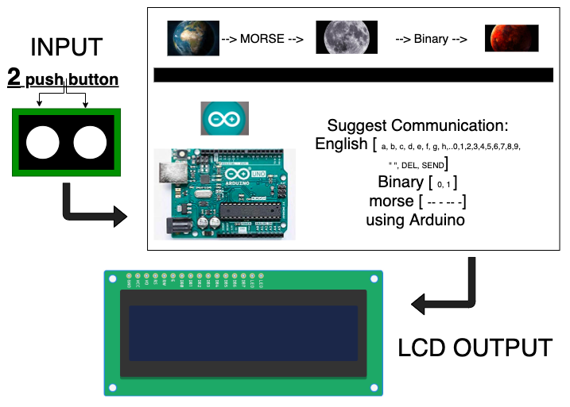
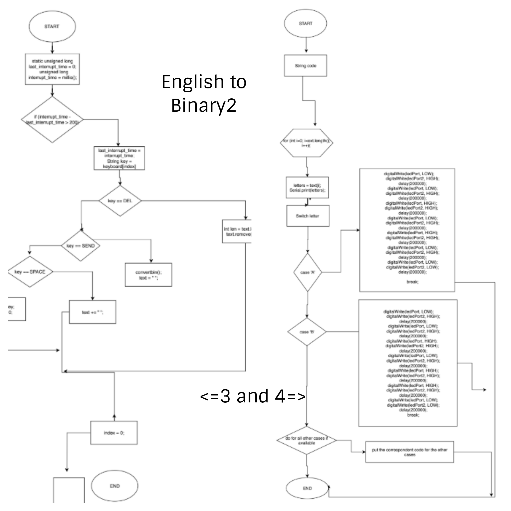
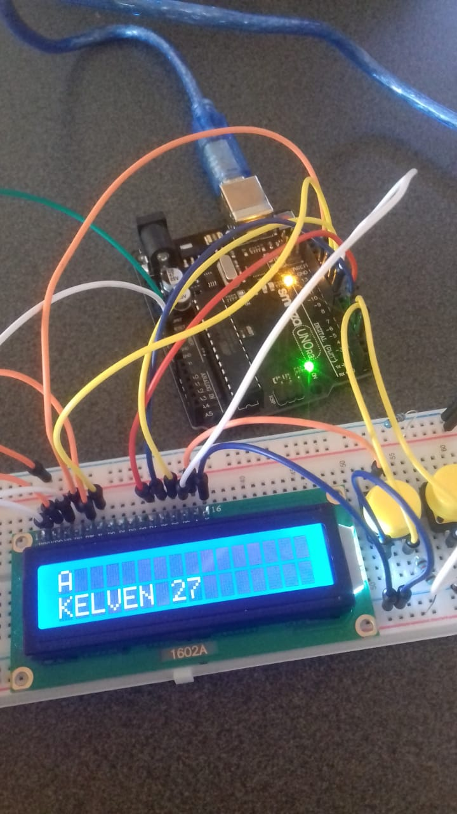

# •••Communication••• 
# Morse code and Binary code UNIT2 Project
-------------------------------------------------------------
# KelvenManuel 


Communication between the Earth the moon and Mars using Arduino 

# Contents
---------
  1. [Planning](#Planning)
  2. [Design](#Design)
  3. [Development](#Development)
  4. [Evaluation](#Evaluation)
  
  
 # 1.Planning 
 -------------
 
 ### Definition of the Problem 
 In 2050, The company "Explore", a big company of communications, wants to explore other planets and develop communication between them.therefore create spatial communication and develop their communication skills to another level. On the other hand, the communication nowadays still uncertain. they built 3 station, one in the Earth that can only communicate using Morse code, the second station in the Moon that can only communicate in Binary and the final station in Mars that they need us to provide a channel of communication. 
 
 ### Proposed Solution 
 Create a program using Arduino that will allow the user to communicate between the station, in other words,  efficient coding that will allow the user to use Binary, Morse and English as a way of communication between stations, being able to recieve and send messages.
 
Why Arduino?
we decide to use Arduino because is a great tool for developing interactive objects, taking inputs from a variety of switches or sensors and controlling a variety of lights. Arduino offer the ability of using lights as a way of communication, were with efficient coding we can create aprogram that can (using lights) send information in english but in Morse and binary communication.
 
 ### success criteria
 
 • Clear understanding about Arduino, Binary codes, and morse codes
 • Communication between the 2 station Earth and Mars using Morse code; 
 • Communication between Mars and the Moon uses Binary code;
 • Data Encoding;
 • find a communication system that allow stations to communicate completely using English but in morse or binary communication
 • Keyboard input on each station is limited to 2push buttons. 
 • 100W lights are buzzers are available 
 
 
 
 # 2.Desing
 ----------
 
# First sketch of system
This the sytem diagram of the program where we put the inputs ( buttons ), the program, and the output (LCD);
In the LCD we are expected to see, and write the message using the pushbuttons. See in fig1

### fig.1

# Traffic lights system using Arduino 

### fig.2

"Introduction of Arduino"
As we see in fig2  we build a basic arduino system, with the board connected with the Arduino Uno using cables, the lights in the board and connected with the board as well. Having the system build and a correct coding we can use the lights this will allow us to turn them ON or OFF according the way that we want. We use Arduino to make a system of traffic lights this that help us to understand how Arduino works. Additionally understand basic coding of the lights, how to turn OFF and ON, this will be essention to achieve our goals in the way that the lights will be our way of communication between stations. this is a prove off our ability to build system and use the lights. Moreover we have the code that we use to make the traffic lights system.( See under this paragraph )

```.sh
void setup()
{
  pinMode(13, OUTPUT);
  pinMode(12, OUTPUT);
  pinMode(11, OUTPUT);
}

void loop()
{
  digitalWrite(13, HIGH);
  delay(1000); // Wait for 1000 millisecond(s)
  digitalWrite(13, LOW);
  delay(1000); // Wait for 1000 millisecond(s)
  digitalWrite(12, HIGH);
  delay(1000); // Wait for 500 millisecond(s)
  digitalWrite(12, LOW);
  delay(1000); // Wait for 500 millisecond(s)
  digitalWrite(11, HIGH);
  delay(1000); // Wait for 1000 millisecond(s)
  digitalWrite(11, LOW);
  delay(1000); // Wait for 1000 millisecond(s)
}
```
# Arduino 
Arduino is an open-source electronics platform based on easy-to-use hardware and software. It's intended for anyone making interactive projects.

# cabes system using Arduino to make a binary count


Hving the basic knowledge about how to build a system with cables and lights using the Arduino, and knowing how to turn ON and OFF
### fig.3

```.sh
 int ledPin[] = {13,12,11,10,9,8};
// an arry to define the pins

void setup()
{
  for (int i = 0; i < 5; i++)
  {
    pinMode(ledPin[i], OUTPUT);
  }
}

void loop()
{
  for (byte counter = 0; counter <= 32; counter++)
  {
    displayBinary(counter);
    delay(2000);
  }
}

void displayBinary(byte num)
{
  for (int i = 0; i < 5; i++)
  {
    if (bitRead(num, i)==1)
    {
      digitalWrite(ledPin[i], HIGH);
    }
    else
    {
      digitalWrite(ledPin[i], LOW);
    }
  }

}
```

# FLOW CHARTS 
in this section there are all flowchart of all the programs
English input
English to Morse (vice versa)
English to Binary (vice versa)
In this flowcharts we can see diagrams that depicts the process to create the programs, with this the user can visualize an idea or process we went through, in this flow chart there is a summary off all the codes that we use to create all the programs. These graphics should explain the manner clearly and even give the essence of a process flow in a single look.
### English input 

### English to Morse

### Morse to English

### Binary to English

### English to Binary 




 
 # 3.Development 
 --------------
 
 # Using Arduino,coding and lights to build a segment display 

fig.4

Using more arduino, we acquire knowledge that will be fundamental to achieve our goal

```.sh 
int butA = 13;
int butB = 12;
int butC = 11;
int out1 = 10;
int out2 = 9;
int out3 = 8;
int out4 = 7;
int out5 = 6;
int out6 = 5;
int out7 = 4;
  
void setup()
{
  pinMode(butA, INPUT);
  pinMode(butB, INPUT);
  pinMode(butC, INPUT);
  pinMode(out1, OUTPUT);
  pinMode(out2, OUTPUT);
  pinMode(out3, OUTPUT);
  pinMode(out4, OUTPUT);
  pinMode(out5, OUTPUT);
  pinMode(out6, OUTPUT);
  pinMode(out7, OUTPUT);
 
}

void loop()
{
  bool A = digitalRead(butA);
  bool B = digitalRead(butB);
  bool C = digitalRead(butC);
  
  bool eq1 = B || (!A && !C) || (A && C);
  digitalWrite(out1, eq1);
  
  bool eq2 = !A || (C && B) || (!B && !C);
  digitalWrite(out2, eq2);
  
  bool eq3 = (!A && !B) || C || (A && !C);
  digitalWrite(out3, eq3);
  
  bool eq4 = (!A && !C) || (!A && B) || (B && !C) || (A && !B && C);
  digitalWrite(out4, eq4);
  
  bool eq5 = (!A && !C) || (!A && !B);
  digitalWrite(out5, eq5);
  
  bool eq6 = (A && !B) || !C;
  digitalWrite(out6, eq6);
  
  bool eq7 = (A && !C);
  digitalWrite(out7, eq7);
  
}
```
 
 # First steps about Binary code ( binary to decimal conversion ) 
 ```.sh 
 count base 8 binary    count base 4 binary       desimal 15 to Binary 
 
  n%8                    n%4                      num   A    B    C    D 
  
   0                      0                        0    0    0    0    0
   1                      1                        1    0    0    0    1
   2                      2                        2    0    0    1    0
   3                      3                        3    0    0    1    1 
   4                      0                        4    0    1    0    0
   5                      1                        5    0    1    0    1 
   6                      2                        6    0    1    1    0
   7                      3                        7    0    1    1    1
   0                      0                        8    1    0    0    0 
   1                      1                        9    1    0    0    1
   2                      2                        10   1    0    1    0 
   3                      3                        11   1    0    1    1 
   4                      0                        12   1    1    0    0
   5                      1                        13   1    1    0    1
   6                      2                        14   1    1    1    0 
   7                      3                        15   1    1    1    1 
   
                                                       bit  bit  bit  bit 
                                                        3    2    1    0 
```
# conversion of base 2 to 10
1. Write down the binary number.
2. Write down the position of the individual numbers (1’s and 0’s) starting from the furthermost right. The first digit should have a position zero.
3. Express the positions in terms of powers of two. (eg. 8^0 for position zero)
4. Multiply the individual numbers by the powers of two
5. Add the products.
# conversion of base 10 to other bases 
1. Write down the number.
2. Write down the position of the individual numbers starting from the furthermost right. The first digit should have a position zero.
3. Express the positions in terms of powers of the base. (eg. 8^0 for position zero)
4. Multiply the individual numbers by the powers of the base.
5. Add the products.

# The HEXADECIMAL base 
this base is different from other, the numbers 10 to 15 are expressed using only digits, instead of using digits. 
Eg: A=10 B=11 C=12 D=13 E=14 F=15 


# Boolean Operators, Logit gates and truth tables 

fig.5
 
we can see the essensial Boolean operations ( logic gates ) and their match in basic arithmetic operations. [right side ]

Addictionaly we can see the truth tables for the basic Boolean operation( OR AND NOT XOR ) [left side ]


### Understanding Boolean operations 

# What is Usability?
A: Usability is the ease of use learnability of a human-made object.[1]

### Principles of desgn 
• Discoverability
• Feedback 

# Morse code
Understant this communication will be essancial to achieve our main goal in this project.


fig.6


# English input System 
--------------------------

this tables show us Every input that we are goin to use to communicate with other station in Binary 


fig.7

# Arduino && English input system 

Using the Arduino and practical codes, we were able to create a system where we can write a message on the Arduino's LCD using only two buttons. Additionally, having within that system the option to delete, space and send the message "managing only 2 buttons".


fig.8

### This is the code that allows us to write a message in arduino
```.sh 
// include the library code:
#include <LiquidCrystal.h>
int index = 0; 
// add all the letters and digits to the keyboard
String keyboard[]={"A", "B","C", "D", "E", "F", "G", "H", "I", "J", "K", "L", "M", "N", "O", "P", "Q", "R", "S", "T", "U", "V", "W", "X", "Y", "Z", "0", "1", "2", "3", "4", "5", "6", "7", "8", "9"};
String text = "";
int numOptions = 3;

char letters;

string code;
char try[6]={"0", "0","0", "0", "0", "0"};
Strind[] = lenght;


// initialize the library with the numbers of the interface pins
LiquidCrystal lcd(12, 11, 5, 4, 9, 8);

void setup() {
  // set up the LCD's number of columns and rows:
  lcd.begin(16,2);
  // Print a message to the LCD.
  attachInterrupt(0, changeLetter, RISING);//button A in port 2
  attachInterrupt(1, selected, RISING);//button B in port 3
  
 
  
}

void loop() {
  // set the cursor to column 0, line 1
  // (note: line 1 is the second row, since counting begins with 0):
  lcd.clear();
  lcd.setCursor(0, 0);
  lcd.print(keyboard[index]);
  lcd.setCursor(0, 1);
  lcd.print(text);
  delay(100);
}

//This function changes the letter in the keyboard
void changeLetter(){
  static unsigned long last_interrupt_time = 0;
  unsigned long interrupt_time = millis();
  if (interrupt_time - last_interrupt_time > 200)
  {
  
    last_interrupt_time = interrupt_time;// If interrupts come faster than 200ms, assum
    index++;
      //check for the max row number
    if(index==numOptions){
      index=0; //loop back to first row
    } 
 }
}

//this function adds the letter to the text or send the msg
void selected(){
  static unsigned long last_interrupt_time = 0;
  unsigned long interrupt_time = millis();
  if (interrupt_time - last_interrupt_time > 200)
  {
  
    last_interrupt_time = interrupt_time;// If interrupts come faster than 200ms, assum
    
    String key = keyboard[index];
    if (key == "DEL")
    {
      int len = text.length();
      text.remove(len-1);
    }
    else if(key == "SENT")
    {
      convertBin();
      text="";
    }
    else if(key == "SPACE")
    {
	   text += " ";
    }else{
      text += key;
    }
    index = 0; //restart the index
  }
  
}
```
  
 4.Evaluation 
 --------------
 
 
 
### References 
[1] By: https://ib.compscihub.net/wp-content/uploads/2018/06/1.2.12.pdf


