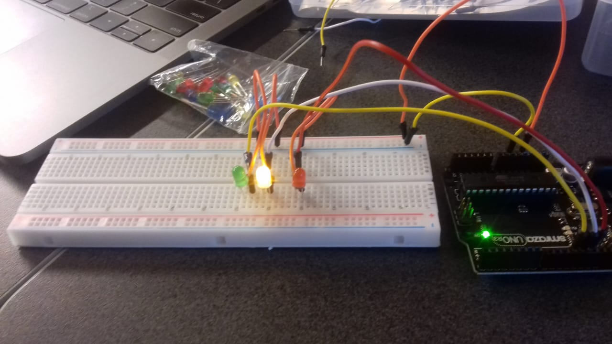
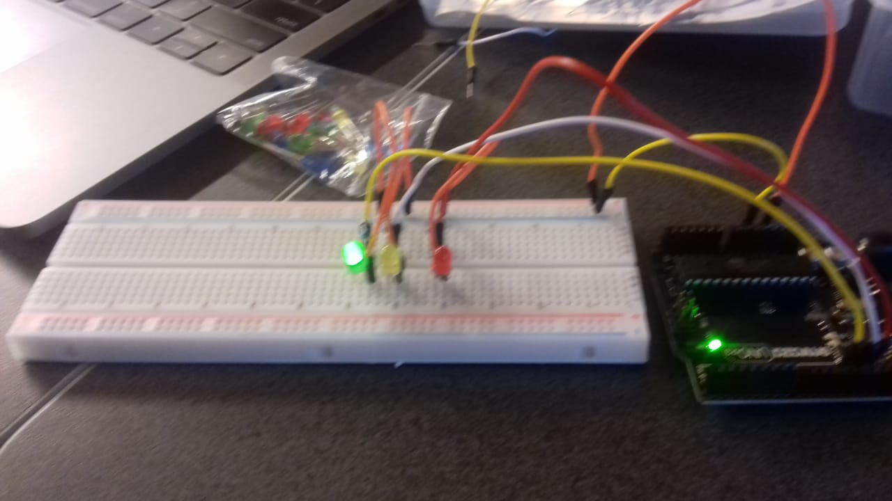
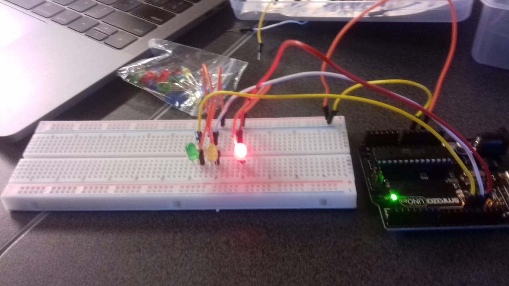
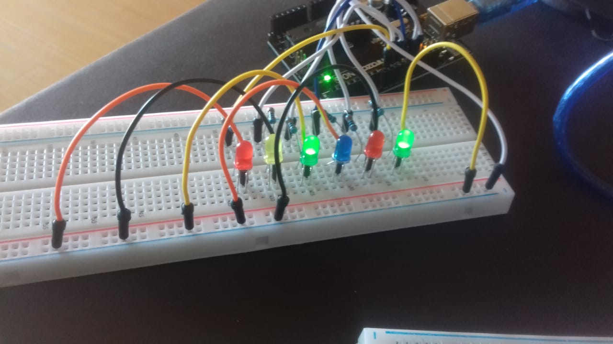

# •Communication• Morse code and Binary code UNIT2 Project
-------------------------------------------------------------
# KelvenManuel 


Communication between the Earth the moon and Mars using Arduino 

Contents
---------
  1. [planning](#Planning)
  2. [Design](#Design)
  3. [Development](#Development)
  4. [Evaluation](#Evaluation)
  
 1.Planning 
 -------------
 
 ### Definition of the Problem 
 In 2050, The company Explore wants to explore other planets, on the other hand, the communication nowadays still uncertain. they have 3 station one in the Earth that can only communicate using Morse code, the second station in the Moon can only communicate in Binary and the final station in Mars that they need us to provide a channel of communication. 
 
 ### Proposed Solution 
 
 ### success criteria
 
 • Communication between the 2 station Earth and Mars using Morse code; 
 • Communication between Mars and the Moon uses Binary code;
 • find a communication system that allow stations to communicate completely using English 
 • Keyboard input on each station is limited to 2push buttons. 
 • 100W lights are buzzers are available 
 
 
 2.Desing
 ----------
# Traffic lights system 




# cabes system using Arduino to turn on the light 


# Using Arduino,coding and lights to build a segment display 


 
 3.Development 
 --------------
 
 # First steps about Binary code ( binary to decimal conversion ) 
 ```
 count base 8 binary    count base 4 binary       desimal 15 to Binary 
 
  n%8                    n%4                      num   A    B    C    D 
  
   0                      0                        0    0    0    0    0
   1                      1                        1    0    0    0    1
   2                      2                        2    0    0    1    0
   3                      3                        3    0    0    1    1 
   4                      0                        4    0    1    0    0
   5                      1                        5    0    1    0    1 
   6                      2                        6    0    1    1    0
   7                      3                        7    0    1    1    1
   0                      0                        8    1    0    0    0 
   1                      1                        9    1    0    0    1
   2                      2                        10   1    0    1    0 
   3                      3                        11   1    0    1    1 
   4                      0                        12   1    1    0    0
   5                      1                        13   1    1    0    1
   6                      2                        14   1    1    1    0 
   7                      3                        15   1    1    1    1 
   
                                                       bit  bit  bit  bit 
                                                        3    2    1    0 
```
What is Usability?
A: Usability is the part of the user experience[1], process of designing a product with the user in mind[2]. Degree of earse that a product can be used to attain the proposed goal. 

### Principles of desgn 
• Discoverability
• Feedback 


[3] Posner J, Mars R. " It is not you. Bad doors are everywhere". 2016.Retrieved on 25th nov 19.
   
 4.Evaluation 
 --------------
 
 
 
### 


